```mermaid
graph TD
    A[Monolithic] -->|✓| Arch
    B[Modular] -->|✓| Arch & Struct
    C[Microservices] -->|✓| Arch
    D[Service-Oriented] -->|✓| Arch
    E[Serverless] -->|✓| Arch & Comm
    F[Event-Driven] -->|✓| Comm
    G[Reactive] -->|✓| Comm
    H[Aspect-Oriented] -->|✓| Struct
    I[Hexagonal] -->|✓| Struct
    J[Progressive] -->|✓| Comm & Strategy
    K[Hybrid] -->|✓| All
```

# 📘 Software Architecture Paradigms / Software-Architektur-Paradigmen

> 🌍 This page is bilingual (EN / DE) and can be used in MkDocs with collapsible sections, Mermaid
> diagrams, and navigation support.

---

EN: This document illustrates key software architecture concepts in their proper context. Small examples illustrate the differences between paradigms and how they interact when combined.

DE: Dieses Dokument zeigt die wichtigsten Software-Architekturbegriffe in ihrem korrekten Kontext beschreibt. Mit kleinen Beispielen wird aufgezeigt, wie sich die einzelnen Paradigmen unterscheiden und wie sie in Kombination wirken.

---

## 📊 Overview Table / Gesamtübersicht

| Paradigm         | Architecture | Communication  | Structure | Strategy |
| ---------------- | ------------ | -------------- | --------- | -------- |
| Monolithic       | ✅           |                |           |          |
| Modular          | ✅           |                | ✅        |          |
| Microservices    | ✅           | 🟡 often Event |           |          |
| Service-Oriented | ✅           | 🟡 sync        |           |          |
| Serverless       | ✅           | ✅             |           |          |
| Event-Driven     |              | ✅             |           |          |
| Reactive         |              | ✅             |           |          |
| Aspect-Oriented  |              |                | ✅        |          |
| Hexagonal        |              |                | ✅        |          |
| Progressive      |              | ✅             |           | ✅       |
| Hybrid           | ✅           | ✅             | ✅        | ✅       |

---

## 🧭 1. Architecture Style / Architektur-Stil

How the overall system is structured / Wie das Gesamtsystem strukturiert ist.

| Paradigm (EN)    | Paradigma (DE)    | Description (EN)                                             | Beschreibung (DE)                                               |
|------------------|-------------------|--------------------------------------------------------------|-----------------------------------------------------------------|
| Monolithic       | Monolithisch      | A single deployable unit, typically layered                  | Eine einzige deploybare Einheit, meist mit Schichten            |
| Modular          | Modular           | Clear separation into modules within one deployment          | Klare Trennung in Module innerhalb eines Deployments            |
| Microservices    | Microservices     | Distributed system of autonomous, self-contained services    | Verteiltes System aus autonomen, eigenständigen Services        |
| Service-Oriented | Serviceorientiert | Similar to Microservices, often with shared bus (e.g., SOAP) | Ähnlich Microservices, aber oft mit gemeinsamer Bus-Integration |
| Serverless       | Serverless        | Code runs in cloud functions, triggered by events            | Code läuft als Funktionen in der Cloud, getriggert durch Events |
| Hybrid           | Hybrid            | Combination of several paradigms                             | Kombination mehrerer Paradigmen                                 |

---

## ⚙️ 2. Communication Style / Kommunikationsstil

How components or data interact / Wie Komponenten oder Daten interagieren.

| Paradigm (EN) | Paradigma (DE) | Description (EN)                                     | Beschreibung (DE)                                    |
|---------------|----------------|------------------------------------------------------|------------------------------------------------------|
| Event-Driven  | Event-Driven   | Communication via asynchronous events                | Kommunikation über asynchrone Events                 |
| Reactive      | Reaktiv        | Response to data streams instead of imperative flow  | Reaktion auf Datenflüsse statt imperativer Steuerung |
| Progressive   | Progressiv     | Incremental enhancement (frontend or microfrontends) | Schrittweise Erweiterung (Frontend/Microfrontends)   |

---

## 🧼 3. Structure / Design Paradigm / Struktur- oder Entwurfsparadigma

How internal component structure is organized / Wie der innere Aufbau gestaltet ist.

| Paradigm (EN)   | Paradigma (DE)   | Description (EN)                                            | Beschreibung (DE)                                             |
|-----------------|------------------|-------------------------------------------------------------|---------------------------------------------------------------|
| Hexagonal       | Hexagonal        | Separates application core from I/O, enabling testability   | Trennt Anwendungskern von I/O für bessere Testbarkeit         |
| Modular         | Modular          | Self-contained components with stable interfaces            | Abgegrenzte Teile mit stabilen Schnittstellen                 |
| Aspect-Oriented | Aspektorientiert | Separation of cross-cutting concerns like logging, security | Trennung von Querschnittsfunktionen wie Logging oder Security |

---

## 🧪 4. Meta-Strategy / Architekturstrategie

How a system evolves or combines / Wie sich ein System entwickelt oder kombiniert wird.

| Paradigm (EN) | Paradigma (DE) | Description (EN)                                         | Beschreibung (DE)                                           |
|---------------|----------------|----------------------------------------------------------|-------------------------------------------------------------|
| Hybrid        | Hybrid         | Combining multiple paradigms intentionally               | Bewusste Kombination mehrerer Paradigmen                    |
| Progressive   | Progressiv     | Non-invasive, extendable strategy (e.g., migration path) | Ausbaubare, nicht-invasive Strategie (z. B. Migrationspfad) |

---



---

## 💡 Examples & Snippets / Beispiele & Codeausschnitte

### Hexagonal

**Java Example:**

```java
public interface OrderRepository {
    Order findById(String id);
}

public class OrderService {
    private final OrderRepository repository;
    public OrderService(OrderRepository repository) {
        this.repository = repository;
    }
}
```

**PHP Example:**

```php
interface OrderRepository {
    public function findById(string $id): Order;
}

class OrderService {
    public function __construct(private OrderRepository $repo) {}
}
```

---

### Reactive

**Java (Project Reactor):**

```java
Flux<String> stream = Flux.just("A", "B", "C")
    .map(String::toLowerCase)
    .filter(s -> s.contains("a"));
```

---

### Event-Driven

**JavaScript (Node.js):**

```js
const EventEmitter = require('events');
const bus = new EventEmitter();

bus.on('orderCreated', (order) => {
    console.log('New order:', order);
});

bus.emit('orderCreated', {id: 1});
```

---

# Architecture Plan - Schema Definition

```yaml
$schema: "https://json-schema.org/draft/2020-12/schema"
title: Software Architecture Plan
version: "2.1"
type: object
properties:
    version:
        type: string
        default: "2.1"
    metadata:
        type: object
        properties:
            name: { type: string }
            author: { type: string }
            created: { type: string, format: date-time }
            description: { type: string }
    modules:
        type: array
        items:
            type: object
            required: [ name ]
            properties:
                name: { type: string }
                description: { type: string }
                type:
                    type: string
                    enum: [ domain, application, infrastructure, presentation, external ]
                framework:
                    type: object
                    properties:
                        name: { type: string, description: "Framework or CMS used" }
                        version: { type: string, description: "Framework version" }
                        file_structure:
                            type: object
                            description: "Folder/file layout of this module for the framework"
                            properties:
                                root: { type: string }
                                subfolders:
                                    type: array
                                    items: { type: string }
                                files:
                                    type: array
                                    items: { type: string }
                behaviors:
                    type: array
                    items:
                        type: string
                        enum: [ Reactive, Event-Driven, Progressive, Hybrid, Monolithic, Modular, Microservices, Service-Oriented, Serverless, Hexagonal, Aspect-Oriented ]
                    description: List of behavioral patterns this module exhibits
                components:
                    type: array
                    items:
                        type: object
                        required: [ name ]
                        properties:
                            name: { type: string }
                            type: { type: string }
                            description: { type: string }
                            behaviors:
                                type: array
                                items:
                                    type: string
                                    enum: [ Reactive, Event-Driven, Progressive, Hybrid, Monolithic, Modular, Microservices, Service-Oriented, Serverless, Hexagonal, Aspect-Oriented ]
                relations:
                    type: array
                    items:
                        type: object
                        required: [ from, to ]
                        properties:
                            from: { type: string }
                            to: { type: string }
                            type:
                                type: string
                                enum: [ uses, depends_on, extends, implements, triggers, publishes, subscribes ]
                            note: { type: string }
                diagram:
                    type: string
                    enum: [ class, flow, sequence, component, file_structure ]
required: [ modules ]
```

## 2️⃣ Example Module Definition

This schema could be used to generate architecture documentation automatically or visualize the
system structure effectively.

AI tools could parse this schema to create software plans, diagrams or reports.

```yaml
modules:
    -   name: BlogModule
        description: Handles blog posts, comments, and user interactions
        type: application
        framework:
            name: Laravel
            version: "10.x"
            file_structure:
                root: blog_module/
                subfolders:
                    - Controllers
                    - Models
                    - Views
                    - Tests
                files:
                    - routes/web.php
                    - config/blog.php
        behaviors:
            - Modular
            - Event-Driven
        components:
            -   name: PostController
                type: controller
                description: Manages CRUD operations for posts
                behaviors:
                    - Event-Driven
            -   name: PostModel
                type: model
                description: ORM model for posts
                behaviors:
                    - Reactive
        relations:
            -   from: PostController
                to: PostModel
                type: uses
                note: "Controller interacts with ORM model"
        diagram: file_structure

```

---

# 🏗 Architecture Plan

```mermaid
%% Module Relations & File Structure

graph TD
%% Modules
    BlogModule["BlogModule\n(Laravel 10.x)"]
    UserModule["UserModule\n(Symfony 6.x)"]
    PaymentModule["PaymentModule\n(Node.js 20.x)"]
%% Relations
    BlogModule -->|uses| UserModule
    BlogModule -->|publishes| PaymentModule
    UserModule -->|depends_on| PaymentModule
%% File Structure subgraphs
    subgraph BlogFiles [BlogModule File Structure]
        direction TB
        BlogRoot["blog_module/"]
        Controllers["Controllers/"]
        Models["Models/"]
        Views["Views/"]
        Tests["Tests/"]
        Routes["routes/web.php"]
        Config["config/blog.php"]
        BlogRoot --> Controllers
        BlogRoot --> Models
        BlogRoot --> Views
        BlogRoot --> Tests
        BlogRoot --> Routes
        BlogRoot --> Config
    end

    subgraph UserFiles [UserModule File Structure]
        direction TB
        UserRoot["user_module/"]
        UserControllers["Controllers/"]
        UserModels["Models/"]
        UserTests["Tests/"]
        UserRoot --> UserControllers
        UserRoot --> UserModels
        UserRoot --> UserTests
    end

    subgraph PaymentFiles [PaymentModule File Structure]
        direction TB
        PaymentRoot["payment_module/"]
        PaymentServices["Services/"]
        PaymentModels["Models/"]
        PaymentTests["Tests/"]
        PaymentRoot --> PaymentServices
        PaymentRoot --> PaymentModels
        PaymentRoot --> PaymentTests
    end
````

---

### ✅ How It Works

1. Each **module** is a node showing its **name and framework/version**.
2. Module **relations** (`uses`, `publishes`, `depends_on`) are drawn as arrows between modules.
3. **File structure** of each module is shown as a **subgraph**, including folders and key files.
4. You can **extend** it with behaviors:
    - Add labels like `Modular`, `Event-Driven`, `Reactive` next to modules or components.
    - Use color coding for behavior types.

---

## 🎯 Conclusion / Fazit

* **Architecture styles** define the system's macro structure.
* **Communication and structure paradigms** shape component behavior.
* **Hybrid and progressive** approaches provide flexibility for real-world systems.

📌 *These paradigms can be combined — they are not mutually exclusive.*

